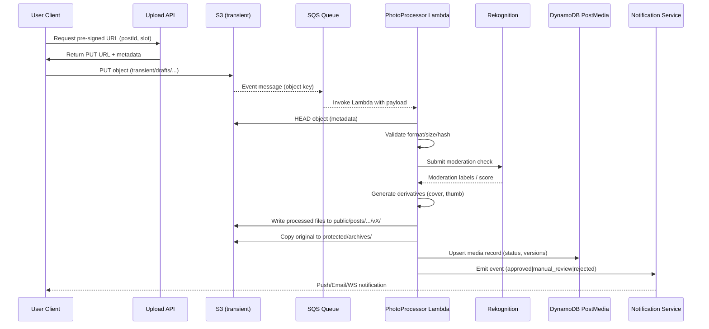

# Photo Processing Pipeline

## Context & Components
- Client app (web/mobile) obtains pre-signed URL via API Gateway + Lambda (`UploadController`).
- Raw upload lands in S3 bucket `oshinooshi-photo-{env}` under `transient/drafts/{userId}/{uuid}.jpg`.
- S3 event (`ObjectCreated`) sends message to SNS → SQS queue `photo-intake-queue` for throttling.
- Worker Lambda (`PhotoProcessor`) consumes queue, runs validation, resizing, moderation, tagging, and status updates.
- Support services: AWS Rekognition (optional moderation), AWS Step Functions (for retries), DynamoDB (`PostMedia` table), EventBridge (notifications).

## Sequence Diagram (Mermaid)

## Processing Steps
1. **Validation**
   - Reject if MIME not in allowlist, size >5MB, orientation EXIF missing (attempt auto-fix).
   - Generate checksum to detect duplicate uploads.
2. **Moderation**
   - Rekognition explicit content, violence, text-in-image detection (NGワード抽出用)。
   - Confidence thresholds: ≥0.85 → auto reject, 0.6–0.85 → manual review queue, <0.6 → proceed.
   - Maintain override list for franchise-specific imagery to reduce誤検知。
3. **Derivatives**
   - Create `cover` (max 1200px), `thumb` (400px square) using Sharp or ImageMagick in Lambda with provisioned concurrency。
   - Store derivative metadata (width, height, size) in DynamoDB item.
4. **Metadata & Tagging**
   - Update S3 object tags: `state=active`, `postId`, `version`, `moderationStatus`。
   - Write DynamoDB record including moderation result, processing timestamps, user-visible status。
5. **Notifications**
   - Approved → EventBridge rule triggers SNS topic for in-app/LINE通知。
   - Manual review → Insert into DynamoDB `ModerationQueue` table, trigger Ops dashboard alert。
   - Rejected → auto-archive object and notify user with reason.
6. **Error Handling**
   - Transient errors: Lambda retries (max 3) + DLQ for manual inspection。
   - Fatal errors: mark media `processing_failed`, notify user to re-upload。

## Configuration Notes
- Lambda memory 1024MB, timeout 30s, uses EFS for Sharp binaries if必要。
- Concurrency control via SQS batch size 1, visibility timeout 2 minutes。
- Step Functions optional for multi-step moderation (future video support想定)。
- Metrics: Emit CloudWatch dimensions (`Outcome`, `LatencyMs`, `ImageSizeKB`) for dashboards。
